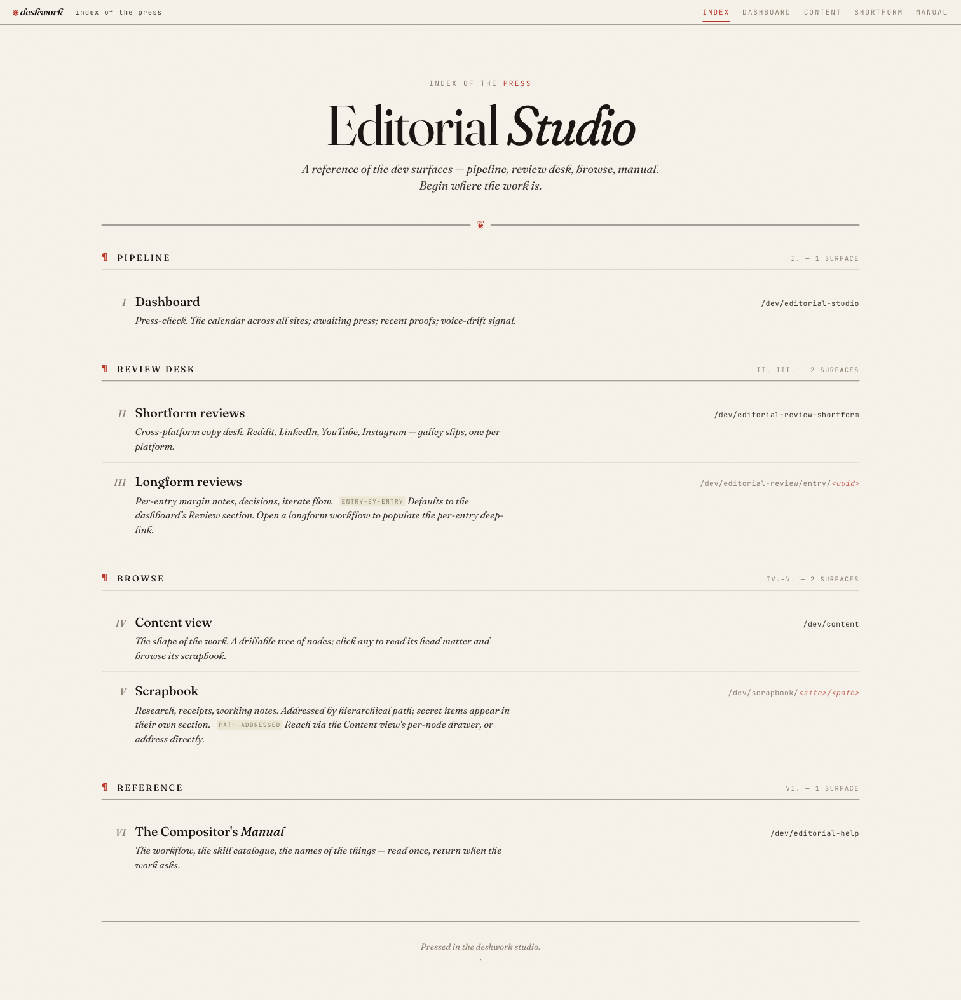
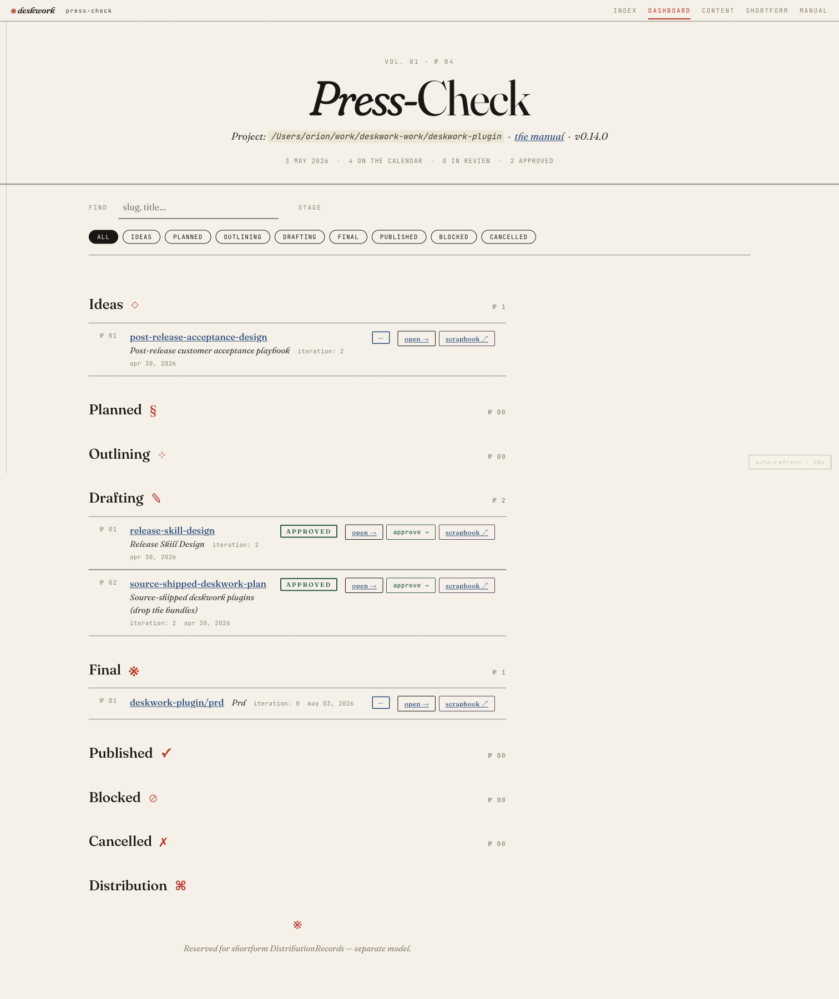
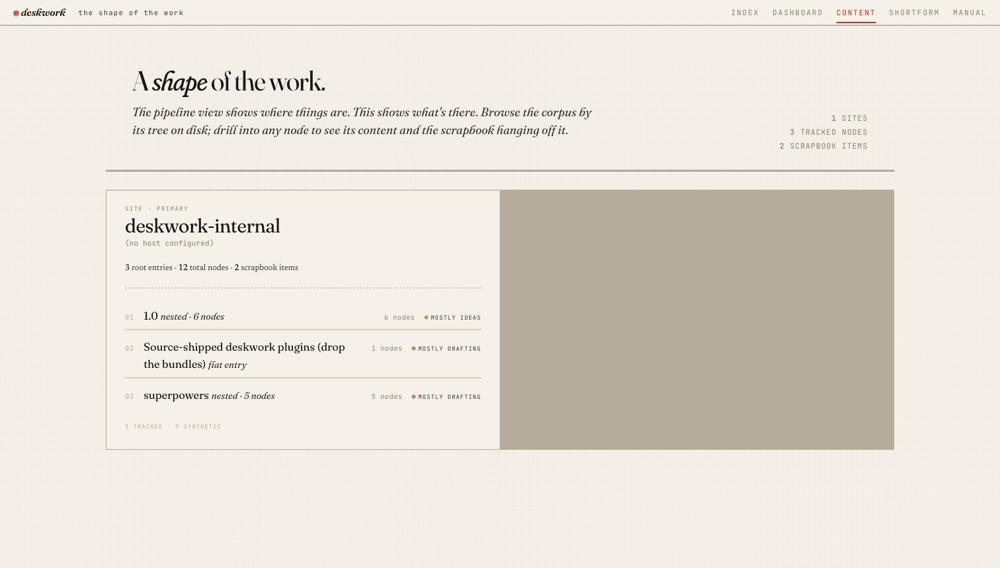
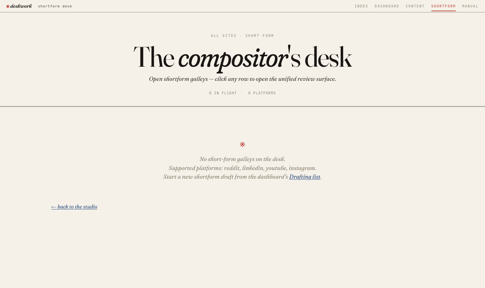
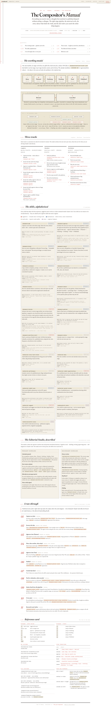
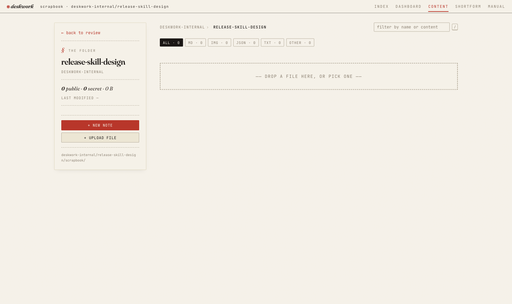
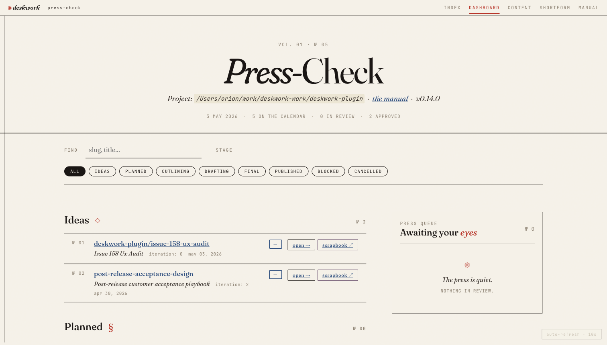
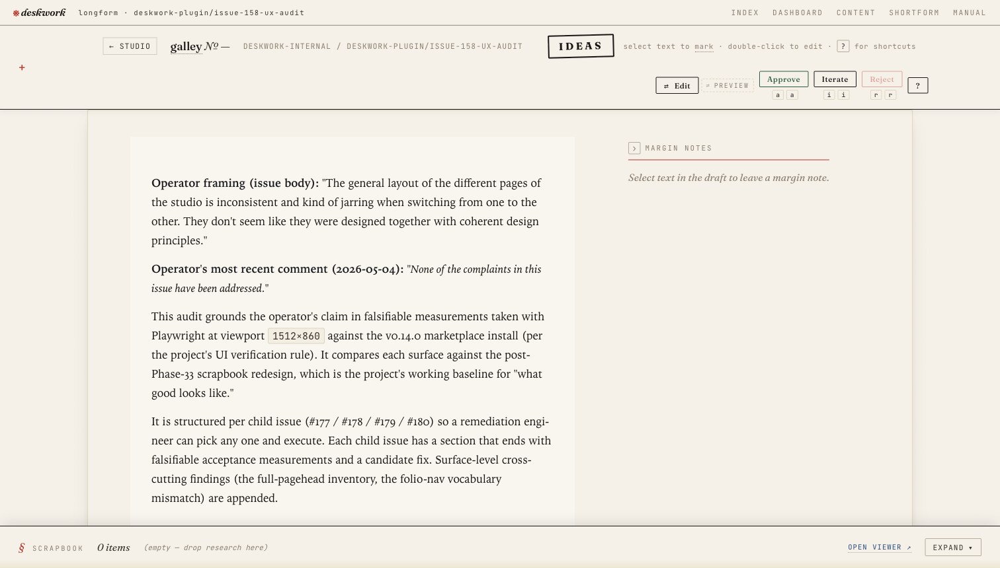
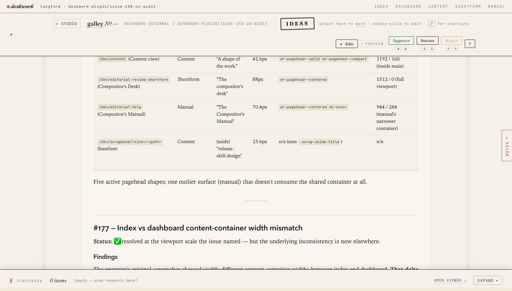

---
deskwork:
  audit: issue-158-ux-consistency
  date: 2026-05-03
  surfaces: [ /dev/, /dev/editorial-studio, /dev/content, /dev/editorial-review-shortform, /dev/editorial-help, /dev/scrapbook ]
  viewport: 1512x860
  studio_version: v0.14.0
  id: 36a268a4-c7ac-4802-8992-20319a08fa92
---

# Issue #158 UX-consistency audit — 2026-05-03

**Operator framing (issue body):** "The general layout of the different pages of the studio is inconsistent and kind of jarring when switching from one to the other. They don't seem like they were designed together with coherent design principles."

**Operator's most recent comment (2026-05-04):** *"None of the complaints in this issue have been addressed."*

This audit grounds the operator's claim in falsifiable measurements taken with Playwright at viewport `1512×860` against the v0.14.0 marketplace install (per the project's UI verification rule). It compares each surface against the post-Phase-33 scrapbook redesign, which is the project's working baseline for "what good looks like."

It is structured per child issue (#177 / #178 / #179 / #180) so a remediation engineer can pick any one and execute. Each child issue has a section that ends with falsifiable acceptance measurements and a candidate fix. Surface-level cross-cutting findings (the full-pagehead inventory, the folio-nav vocabulary mismatch) are appended.

## Methods

- Studio booted via `deskwork-studio --project-root /Users/orion/work/deskwork-work/deskwork-plugin` against this monorepo's `.deskwork/` (one site: `deskwork-internal`).
- Browser viewport pinned to `1512×860` (matches the operator's screenshots in #158).
- Per surface: `getComputedStyle()` on `main` / `.er-container` / `.er-pagehead` / typography elements; `getBoundingClientRect()` for x-positions and widths; full-page screenshots captured at the same viewport.
- Screenshots saved to the entry's scrapbook (`scrapbook/` adjacent to this file). Inline embeds use portable relative URLs (`./scrapbook/<filename>`) — these render correctly in any markdown viewer (GitHub, VS Code, IDE preview). The studio's review surface rewrites them at HTML-emit time to absolute scrapbook-file route URLs (`/api/dev/scrapbook-file?site=…&entryId=…&name=…`) so they also render against the served HTML page; that rewrite is invisible to the markdown source.

## Surface inventory at a glance

| Surface | Folio active | h1 text | h1 size | Pagehead variant | Pagehead w / x | Main w / x | Body bg |
|---|---|---|---|---|---|---|---|
| `/dev/` (Index) | Index | "Editorial Studio" | 88px | `er-pagehead--centered er-pagehead--toc` | 1192 / 160 (inside main) | 1248 / 132 | paper-grain |
| `/dev/editorial-studio` (Dashboard) | Dashboard | "Press-Check" | 88px | `er-pagehead--centered` | 1512 / 0 (full viewport) | 1248 / 132 | paper-grain |
| `/dev/content` (Content view) | Content | "A shape of the work." | 41.6px | `er-pagehead--split er-pagehead--compact` | 1192 / 160 (inside main) | 1248 / 132 | paper-grain |
| `/dev/editorial-review-shortform` (Compositor's Desk) | Shortform | "The compositor's desk" | 88px | `er-pagehead--centered` | 1512 / 0 (full viewport) | 1248 / 132 | paper-grain |
| `/dev/editorial-help` (Compositor's Manual) | Manual | "The Compositor's Manual" | 70.4px | `er-pagehead--centered eh-cover` | 944 / 284 (manual's narrower container) | n/a (no `er-container`) | transparent |
| `/dev/scrapbook/<site>/<path>` (baseline) | Content | (aside) "release-skill-design" | 25.6px | n/a (uses `.scrap-aside-title`) | n/a | 1248 / 132 (`scrap-page` grid: 272+880) | paper-grain |

Five active pagehead shapes; one outlier surface (manual) that doesn't consume the shared container at all.

### Each surface, captured

The full-page screenshots below were captured at viewport `1512×860` against the dev studio when this audit was written. They sit alongside the inventory table so the reader can see what each surface actually looks like, not just read the measurements.

**`/dev/` — Index** (centered TOC, h1 "Editorial Studio"):



**`/dev/editorial-studio` — Dashboard** ("Press-Check"; pagehead extends edge-to-edge as a full-viewport band; left column holds stage sections, right column was empty at audit time):



**`/dev/content` — Content view** (the outlier — h1 "A shape of the work." at 41.6 px in a `--split --compact` pagehead; right pane is a literal blank olive-tinted block):



**`/dev/editorial-review-shortform` — Compositor's Desk** (chrome consistent with Dashboard; bare body is the empty state, not a layout defect):



**`/dev/editorial-help` — Compositor's Manual** (the manual's bespoke `eh-cover` system: 944 px container at `x=284`, transparent body bg, 70.4 px h1 — visibly a different application):



**`/dev/scrapbook/<site>/<path>` — Scrapbook viewer (the design baseline)** (post-Phase-33 redesign; aside-LEFT 272 px + main 880 px in `.scrap-page` grid; this is the visual vocabulary the rest of the studio should converge toward):



---

## #177 — Index vs dashboard content-container width mismatch

**Status:** ✅ resolved at the viewport scale the issue named — but the underlying inconsistency is now elsewhere.

### Findings

The operator's original screenshot showed visibly different content-container widths between index and dashboard. **That delta is no longer present.**

- `/dev/`: `main.er-toc-page` → `width 1248`, `max-width 1248px`, `margin 132 / 132`, `padding 28 / 28`.
- `/dev/editorial-studio`: `main.er-container` → `width 1248`, `max-width 1248px`, `margin 132 / 132`, `padding 28 / 28`.
- `/dev/content`: `main.content-page` → `width 1248`, `max-width 1248px`, `margin 132 / 132`, `padding 28 / 28`.
- `/dev/editorial-review-shortform`: `main.er-container` → `width 1248`, `max-width 1248px`, `margin 132 / 132`.
- `/dev/scrapbook/.../...`: `main.scrap-page` → `width 1248`, `max-width 1248px`, `margin 132 / 132`.

**Five of five surfaces consume the same `1248px` content envelope at 1512 viewport.** The width complaint that motivated #177 is no longer reproducible.

### The remaining outlier — moved into #180's scope

`/dev/editorial-help` (the Manual) is the **only** surface that does not consume the `1248px` envelope:

- No `main.er-container` selector at all.
- Its outer container is `944px` wide at `x=284` (margins 284/284), produced by the manual's bespoke `eh-cover` system.

This is the only remaining width-token violation in the studio. **Address it in the #180 work** (the manual's parallel design system needs to be unified anyway) and #177 stays closed.

### Acceptance test for full closure

```js
// Run at viewport 1512×860 against each surface; all five must report 1248.
[...document.querySelectorAll('main')].map(m => Math.round(m.getBoundingClientRect().width))
// Expected: [1248] on every surface (including /dev/editorial-help).
```

### Recommendation

Close #177 once #180 ships (no separate work item required).

---

## #178 — Index and dashboard both render "Editorial Studio" heading; confusing function signal

**Status:** ❌ partially addressed (heading text diverged); ❌ spacing-drift concern *worse*; ❌ folio-nav vocabulary did not follow.

### Findings — heading text (the title-clash sub-concern)

The two surfaces no longer share a heading.

- `/dev/`: `<h1 class="er-pagehead__title">Editorial Studio</h1>`, kicker "Index of the Press".
- `/dev/editorial-studio`: `<h1 class="er-pagehead__title">Press-Check</h1>`, kicker "Vol. 01 · № 04".

The "two pages with the same heading look like they have the same function" complaint is **fixed at the heading text level**.

### Findings — pagehead spacing drift (the second sub-concern)

The pagehead **layouts** still drift. Falsifiable values:

| Surface | Pagehead modifier | Pagehead width | Pagehead x | Inside `main`? |
|---|---|---|---|---|
| `/dev/` | `er-pagehead--centered er-pagehead--toc` | 1192 | 160 | yes |
| `/dev/editorial-studio` | `er-pagehead--centered` | 1512 | 0 | no (full viewport, edge-to-edge with hairline rule) |
| `/dev/editorial-review-shortform` | `er-pagehead--centered` | 1512 | 0 | no |
| `/dev/content` | `er-pagehead--split er-pagehead--compact` | 1192 | 160 | yes |
| `/dev/editorial-help` | `er-pagehead--centered eh-cover` | 944 | 284 | n/a |

So the pagehead has **five layout shapes** in active use:
1. `--centered --toc` (index): centered, inside main, 1192 wide.
2. `--centered` (dashboard, desk): centered, **outside main / full viewport**, 1512 wide.
3. `--split --compact` (content view): two-column grid (~950 + ~133), inside main, 1192 wide, h1 demoted to 41.6px.
4. `--centered eh-cover` (manual): centered, manual-specific narrower container, 944 wide, h1 70.4px.
5. (no pagehead — scrapbook viewer uses `.scrap-aside-title` instead).

Even within the two surfaces the operator originally compared (index vs dashboard), the pagehead block places its h1 differently:

- Index h1 baseline at `x=160, y=154, w=1192` (inside main).
- Dashboard h1 baseline at `x=40, y=134, w=1432` (outside main).

That's the "spacing of the two headings is subtly different" complaint, alive and well. The fix shipped between #158 and v0.14.0 changed the h1 *text* but introduced a structural delta in *where the pagehead lives in the layout* (the dashboard has been promoted to a paper-bordered full-viewport band; the index has not).

### Findings — folio-nav vocabulary

The operator pushed back on "dashboard" terminology in #158: *"I hate that term in this context, since it's a mixed metaphor."* The page h1 was renamed to "Press-Check" in v0.14.0's ship-pass. **The folio nav was not.**

```html
<a href="/dev/editorial-studio">Dashboard</a>   <!-- still says Dashboard -->
```

While `<title>` is `Press-Check — dev` and `<h1>` is "Press-Check," the folio nav link text is "Dashboard." This is a different surface where the operator's vocabulary pushback didn't propagate.

### Acceptance tests

```js
// 1) Heading text diverged: ✓ already passes
new Set([...document.querySelectorAll('.er-pagehead__title')].map(h => h.textContent.trim())).size > 1

// 2) Pagehead width band: should be SAME across index + dashboard (currently differs by 320px)
const indexPagehead = await fetch('/dev/').then(r=>r.text()).then(t => extractPageheadWidth(t));
const dashPagehead = await fetch('/dev/editorial-studio').then(r=>r.text()).then(t => extractPageheadWidth(t));
indexPagehead === dashPagehead   // currently false: 1192 vs 1512

// 3) Folio link should not contradict h1 vocabulary
[...document.querySelectorAll('.er-folio a')].find(a => a.textContent.trim() === 'Dashboard')
// Currently truthy. Should be null after rename to "Press-Check" or similar.
```

### Recommendation (in priority order)

1. **Pick one canonical pagehead variant for "primary work surface" pages and migrate to it.** The two viable options:
   - **A. Inside main, narrow band (1192px).** Index, dashboard, content, shortform desk all sit on the `er-container` and the pagehead lives inside it. Visually quieter; matches the index's current restraint.
   - **B. Outside main, full-viewport band (1512px).** All four surfaces adopt the dashboard's edge-to-edge pagehead with the hairline bottom rule. Visually more committed; matches the dashboard's "press-check" gravity.
   - Pick A or B; *do not keep both*. The operator's complaint is exactly that mixed-mode pageheads read as "different apps."
2. **Rename the folio nav link** from "Dashboard" to whatever the page now calls itself ("Press-Check," or one of the alternatives in #178's candidate fix). The folio is a one-line change in the renderer.
3. **Demote the content view's `--split --compact` pagehead** to the chosen canonical shape (#179's scope, but listed here because it's the same fix).

---

## #179 — Content view is a layout outlier (undeclared, unjustified split, no scrapbook cues)

**Status:** ❌ all three sub-concerns reproduce.

### Sub-concern 1 — Undeclared surface

The page heading is `<h1>A shape of the work.</h1>` (size 41.6px, kicker absent, deck-style sub-line below). This is a poetic phrase, not a noun naming the surface. The folio nav says "Content," but the page itself never says "Content view," "Browse," or anything operator-mappable.

Compare to siblings:
- Index: kicker "Index of the Press" + h1 "Editorial Studio" + deck "A reference of the dev surfaces — pipeline, review desk, browse, manual."
- Dashboard: kicker "Vol. 01 · № 04" + h1 "Press-Check" + sub-line "Project: ... · the manual · v0.14.0 · ... ON THE CALENDAR · ... IN REVIEW · ... APPROVED".
- Compositor's Desk: kicker "All sites · short form" + h1 "The compositor's desk" + sub-line "Open shortform galleys — click any row to open the unified review surface."

Each sibling has a clear declarative kicker + descriptive sub-line. The content view has neither — its kicker slot is empty and the h1 is poetic.

### Sub-concern 2 — Unjustified split-screen

Visible at `1512×860`:

- Left pane: `.site-card` for `deskwork-internal` showing 3 root entries (`1.0`, `Source-shipped...`, `superpowers`), at `x=189, w≈540`.
- Right pane: a large olive-tinted block at approximately `x=730, y=300, w≈680, h≈360`. **It contains nothing.** No header, no message, no instruction. Just a color block.
- See `scrapbook/03-dev-content-1512.png`.

The right pane appears to be a placeholder for a drilldown / detail view that is meant to populate when a node is clicked. In its empty state it has no affordance, no copy ("Click any node to read its head matter…"), no explanatory headline. The operator's framing — *"a split screen layout that doesn't appear to be FOR anything"* — is exactly correct. The split is not signaled, not justified by the empty-state rendering, and not visually anchored to anything the operator would expect to land in it.

The pagehead variant `er-pagehead--split` on this surface has its **own** internal 2-column grid (`gridTemplateColumns: 950.82px 133.18px`) for the title-block + the stats column. So there are actually **two separate split-pane patterns on the same surface** (the pagehead's internal split + the body's site-card-vs-blank split), neither of which is declared.

### Sub-concern 3 — No scrapbook design cues

The scrapbook viewer (the design baseline post-Phase-33) consumes:
- `main.scrap-page` with `display: grid; grid-template-columns: 272px 880px` (aside-LEFT 272 + main 880).
- `.scrap-aside`, `.scrap-aside-kicker`, `.scrap-aside-title` typography in the aside.
- Per-kind ribbons (`.scrap-card[data-kind]` with per-kind color tokens).
- A bordered, slightly-inset card grid in the main pane.

The content view ships **zero** `scrap-*` classes (`document.querySelectorAll('[class*="scrap-"]').length === 0`). It is a parallel composition with its own `site-card` patterns and a flat olive-block right pane.

The two surfaces are conceptually adjacent: scrapbook = research artifacts hanging off one entry; content view = the tree of all entries with their scrapbooks hanging off them. They should feel like the same surface family, telescoping.

### Acceptance tests

```js
// 1) Surface declares itself — kicker present and operator-mappable
const k = document.querySelector('.er-pagehead__kicker, .er-page-kicker');
k && /content|browse|catalog|tree/i.test(k.textContent)   // currently false; kicker absent

// 2) Right pane has either content or an explicit empty-state affordance
const rightPane = document.querySelector('[data-pane="detail"], .content-detail, .es-content-detail');
rightPane === null || rightPane.textContent.trim().length > 0   // currently a colored block with no text

// 3) Surface consumes scrapbook design tokens
document.querySelectorAll('[class*="scrap-"]').length > 0   // currently 0
```

### Recommendation

This is the **largest of the four #158 children** (the issue body itself flagged it as `/frontend-design`-worthy). The right shape is a `/frontend-design` pass that:

1. Adds a clear kicker + h1 (e.g., kicker "Browse · the corpus" + h1 "Content"); reuse the canonical pagehead variant chosen for #178.
2. Either (a) collapses the empty right pane and renders a single-column tree (pulling in scrapbook's aside-LEFT pattern: tree on the left, content-or-scrapbook on the right) — or (b) keeps the split but signals it explicitly: a header like "Tree · click a node to read it here" with a directional caret, plus an empty-state affordance in the right pane ("Select a node to read its head matter and browse its scrapbook").
3. Adopts the scrapbook redesign's design tokens (`.scrap-page`, aside-LEFT grid, per-kind ribbons on entry cards). Preserve the `site-card` content but re-skin it.

Mockup precedent worth re-reading before the design pass: `mockups/birds-eye-content-view.html` (Phase 16d). The "writer's catalog" aesthetic the mockup ships *is* the right direction — and it predates the Phase-33 scrapbook redesign, so the design vocabulary needs a refresh on top.

---

## #180 — Compositor's desk and manual feel like different apps

**Status:** ❌ partially confirmed. Desk is mostly fine; manual is the divergent one.

### Compositor's desk (`/dev/editorial-review-shortform`)

The desk **shares** the dashboard's chrome contract:

| Property | Desk | Dashboard | Match? |
|---|---|---|---|
| Folio chrome | present, active "Shortform" | present, active "Dashboard" | ✓ |
| `main` container width | 1248 | 1248 | ✓ |
| Pagehead variant | `er-pagehead--centered` | `er-pagehead--centered` | ✓ |
| h1 size | 88px | 88px | ✓ |
| h1 font | Fraunces serif | Fraunces serif | ✓ |
| Body bg | `rgb(245,241,232)` paper | `rgb(245,241,232)` paper | ✓ |
| `data-review-ui` | `shortform` | `studio` | (intentional skin selector) |

The empty-state body (with no shortform workflows) renders sparsely (a serif copy block + back-link). That sparseness is **data-driven**, not a design defect — when a shortform workflow exists, the body fills in. The desk does not currently look like a different app from the dashboard once you discount the (legitimate) empty state.

**Verdict for the desk:** keep the chrome unchanged. If anything is to be done here, it is to flesh out the empty state with a "Recent shortform proofs" section or a CTA card to start a draft (mirroring the dashboard's stage-section rhythm). That is enhancement, not consistency-fix.

### Compositor's manual (`/dev/editorial-help`)

The manual is the surface that genuinely reads as a different app. Falsifiable divergences from the dashboard contract:

| Property | Manual | Dashboard | Match? |
|---|---|---|---|
| Outer container | `eh-cover` (no `er-container`) | `main.er-container` | ✗ |
| Container width | 944 | 1248 | ✗ (-304) |
| Container x | 284 | 132 | ✗ (+152) |
| Pagehead h1 size | 70.4px | 88px | ✗ (-17.6) |
| Body bg | `rgba(0,0,0,0)` (transparent — relies on a different layered background) | `rgb(245,241,232)` paper-grain | ✗ |
| Class prefix | `eh-` (manual-specific design system) | `er-` (shared) | ✗ |
| Internal column composition | 3-col skill-card grids, 2-col reference card grids | single column with section heads | ✗ |

The `eh-` namespace appears to be a parallel design system that pre-dates Phase 33's `.scrap-*` work and Phase 34's chrome consolidation. It was never pulled into the unified token set. Visually the manual feels like a magazine-style print spread embedded in the studio chrome; the rest of the studio reads as a single editorial workspace.

### Acceptance tests

```js
// 1) Manual must use the shared container
document.querySelector('main.er-container')   // currently null on /dev/editorial-help

// 2) Body background must match the rest of the studio
getComputedStyle(document.body).backgroundColor === 'rgb(245, 241, 232)'   // currently transparent

// 3) h1 size matches the canonical pagehead — within 1px
Math.abs(parseFloat(getComputedStyle(document.querySelector('.er-pagehead__title')).fontSize) - 88) < 1
// currently 70.4
```

### Recommendation

Two viable shapes — pick one based on whether the operator considers the manual's narrower-text-column composition load-bearing for readability.

**Option A — Full consolidation (preferred for design coherence):** drop the `eh-cover` and `eh-section-title` parallel system; render the manual through `main.er-container` + the canonical pagehead variant; let the manual's section heads use `er-section-head` with a manual-specific data-attribute for any manual-only treatment (e.g. `data-manual-section`). Move the 3-col skill-card grid + 2-col reference card grid into a `.eh-card-grid` layout class (no `er-` namespace pollution) that lives *inside* `er-container`.

**Option B — Compositional skin (preferred for readability):** keep `eh-cover` as a *valid skin* of the canonical pagehead — but make it consume `er-container` for its bounds + paper-grain body bg + 88px h1. The 944-px text column then becomes a `max-width` *within* `er-container`, not a different `main` width.

Either way, the test that has to pass is: **resize from `/dev/editorial-help` to `/dev/editorial-studio` to `/dev/`. The folio chrome, container envelope, body bg, and pagehead size do not visibly jump.** Today they all jump.

---

## Cross-cutting findings (not under any single child issue)

### Pagehead variants in active use (5)

Already enumerated under #178. Recommendation: **the studio should ship at most TWO pagehead variants.** The natural split is:
- **Cover variant** — full-viewport band, edge-to-edge hairline rule, 88px h1 (dashboard, desk, content, manual cover). Used for "you are here" surfaces.
- **TOC variant** — inside-main band, 88px h1, restraint-coded (index). Used for routing surfaces.

Both should live inside `main.er-container` for x-position parity. The dashboard's full-viewport extension is the architectural anomaly, not a feature.

### Folio nav vocabulary lags behind h1 vocabulary

The folio still says "Dashboard" when the page is "Press-Check"; the folio says "Content" when the page is "A shape of the work."; the folio says "Manual" when the page is "The Compositor's Manual." Two of these are fine (manual matches; content's poetic h1 is the bug surfaced under #179). The "Dashboard / Press-Check" delta is straightforwardly the operator's #178 vocabulary pushback that didn't propagate fully.

Fix: rename the folio link to "Press-Check" alongside any decision on #178.

### Body `data-review-ui` is consistent (good)

All five primary surfaces set `body[data-review-ui]` to a meaningful value (`studio`, `shortform`, `manual`, `scrapbook`). This is a clean hook for skin-level CSS overrides. Any consolidation should preserve this convention rather than collapse it.

### Active-link signal in folio (good)

Each surface correctly marks its folio link with `aria-current="page"`. No issue.

---

## Remediation priority (recommended order)

A remediation engineer should pick from this list top-down. Each item is independently shippable; later items get cheaper as earlier ones land.

| Order | Issue | Scope | Why this order |
|---|---|---|---|
| 1 | **#178 pagehead consolidation** | Pick one canonical pagehead variant; migrate index, dashboard, desk, content to it. Rename folio "Dashboard" → match h1. | Largest cross-cutting fix; downstream work simplifies once pagehead vocabulary collapses. Touches CSS only + one folio renderer. |
| 2 | **#180 manual unification** | Render manual through `main.er-container` + paper-grain body bg + canonical pagehead. `eh-` namespace either retired (Option A) or kept as a skin layered on `er-` (Option B). | Closes the most visible "different app" complaint. Closes #177 fully as a side-effect. |
| 3 | **#179 content view redesign** | `/frontend-design` pass: declarative kicker + h1, scrapbook-vocabulary port (`.scrap-*` + aside-LEFT), justify or collapse the right pane. | Largest design surface; benefits from #178 + #180 landing first so the design pass works against a stable baseline. |
| 4 | **#177 cleanup** | Already resolved by #180. Verify the `width === 1248` assertion across all five `main` selectors and close. | Trivial verification; close after #180. |

### What to leave alone

- The compositor's desk's chrome — it is consistent. Body composition richness (more affordance in the empty state) is enhancement work, not a #158 fix.
- The scrapbook viewer's design vocabulary — this *is* the baseline. Don't change it; pull other surfaces toward it.
- `data-review-ui` body attribute convention — preserve.

---

## Falsifiable acceptance bundle (one-shot script)

A single end-to-end check the remediation engineer can run after each landing to verify regressions don't sneak in. Drop into the studio's playwright test harness or run by hand at `1512×860`.

```js
const SURFACES = [
  '/dev/',
  '/dev/editorial-studio',
  '/dev/content',
  '/dev/editorial-review-shortform',
  '/dev/editorial-help'
];

const PASS = { mainW: 1248, h1Size: 88, bodyBg: 'rgb(245, 241, 232)' };

for (const path of SURFACES) {
  await page.goto(`http://localhost:47321${path}`);
  const result = await page.evaluate(() => {
    const main = document.querySelector('main');
    const h1 = document.querySelector('.er-pagehead__title');
    return {
      mainW: main ? Math.round(main.getBoundingClientRect().width) : null,
      h1Size: h1 ? Math.round(parseFloat(getComputedStyle(h1).fontSize)) : null,
      bodyBg: getComputedStyle(document.body).backgroundColor,
      h1Text: h1 ? h1.textContent.trim() : null,
      folioActive: document.querySelector('.er-folio a[aria-current="page"]')?.textContent.trim()
    };
  });
  // Each surface's main must be 1248; each h1 must be 88px (or document the exception);
  // body bg must be the paper-grain. h1 text and folio text must not contradict each other.
  console.log(path, result);
}
```

If all five rows pass `mainW===1248`, `h1Size===88` (or have a documented exception captured in this audit), `bodyBg===PASS.bodyBg`, and `h1Text` ≅ `folioActive` (semantically aligned), #158 is closeable.

---

## Post-fix state (added v3, 2026-05-04)

Several of this audit's findings have shipped fixes since v1 was written. Captures below show the current state so the reader can see what landed without flipping between branches.

**Dashboard right column filled (closes #158's right-pane gap).** The `.er-layout` grid's previously-empty second column now hosts an editorial-chrome press-queue panel — sticky, paper-grain, Fraunces title with red-pencil accent. Empty-state ※ ornament when nothing is in review:



**GFM tables now render as styled HTML tables on the review surface.** Pre-fix, this audit's surface-inventory table rendered as raw `| col | col |` text because `renderMarkdownToHtml` lacked `remark-gfm`. Post-fix, the same table renders with editorial chrome (JetBrains Mono uppercase headers on a paper-2 band; Newsreader cells; `<code>` chips with `white-space: nowrap` so multi-token classnames stay on one line):



**Stowing marginalia widens the article column (closes #187).** Pre-fix, hitting Shift+M / the pull tab moved the article body to center but didn't grant more horizontal real estate. Post-fix, `.essay`'s `max-width` relaxes from 42rem to 64rem when stowed, and tables get visibly more room (6 of 8 columns visible without horizontal scroll):



What's still outstanding from the original audit's remediation order: pagehead consolidation (#178 — 5 active variants need to collapse to a canonical shape), manual unification (#180 — `eh-` namespace still parallel to `er-`), content-view redesign (#179 — kicker, scrapbook-vocabulary port, justify-or-collapse the right pane). Those are the next tranche.

---

## Appendix — Screenshots

All captured at `1512×860` against this monorepo's `.deskwork/` (one site: `deskwork-internal`).

- `scrapbook/02-dev-index-1512.png` — `/dev/`
- `scrapbook/01-dev-editorial-studio-1512.png` — `/dev/editorial-studio`
- `scrapbook/03-dev-content-1512.png` — `/dev/content`
- `scrapbook/04-dev-shortform-1512.png` — `/dev/editorial-review-shortform`
- `scrapbook/05-dev-help-manual-1512.png` — `/dev/editorial-help`
- `scrapbook/06-dev-scrapbook-baseline-1512.png` — `/dev/scrapbook/deskwork-internal/release-skill-design` (design baseline)
- `scrapbook/09-dashboard-with-press-queue-1512.png` — dashboard with press-queue right column (post-fix)
- `scrapbook/17-tables-final.png` — review surface tables rendered with editorial chrome (post-GFM fix)
- `scrapbook/19-tables-final-stowed.png` — review surface with marginalia stowed and article widened (post-#187 fix)

## Appendix — Key file paths for the remediation engineer

(Likely starting points; not exhaustive.)

- Pagehead renderer + `er-pagehead--*` modifiers: search `packages/studio/src/` for `er-pagehead`.
- Folio nav renderer (the "Dashboard / Press-Check" rename): `renderEditorialFolio` (mentioned in journal entries as the unified folio component).
- Index page (`/dev/`): `packages/studio/src/pages/index.ts` (or `pages/dev-index.ts`).
- Dashboard page (`/dev/editorial-studio`): `packages/studio/src/pages/editorial-studio.ts` (or similar).
- Content view (`/dev/content`): `packages/studio/src/pages/content.ts`. The `er-pagehead--split --compact` variant is the demoted heading.
- Compositor's manual (`/dev/editorial-help`): `packages/studio/src/pages/editorial-help.ts`. The `eh-` design system lives in `plugins/deskwork-studio/public/css/editorial-help.css` (or similar).
- Scrapbook viewer (baseline): `packages/studio/src/pages/scrapbook.ts` + `plugins/deskwork-studio/public/css/scrapbook.css`. **Read this before editing the content view** — it is the design pattern to mirror.
- CSS tokens: `plugins/deskwork-studio/public/css/editorial-review.css` defines `--er-page-max`, `--er-container-wide` (added in `ee05e2d`), paper-grain body bg, etc.
