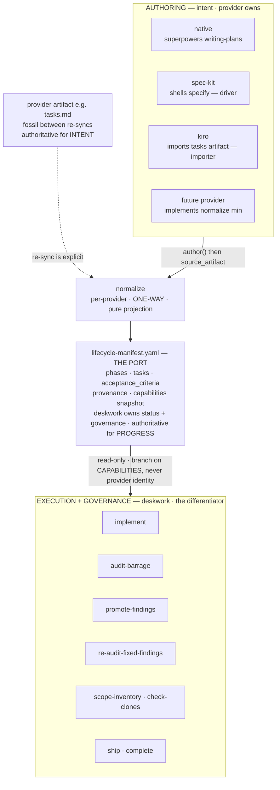
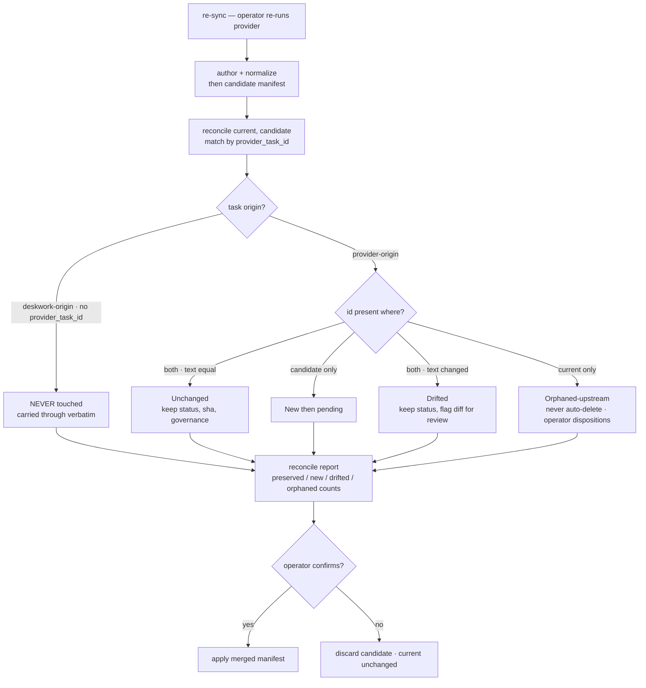

# Pluggable Lifecycle Providers — Design

> **⚠ SUPERSEDED AS THE SPINE (2026-06-04 integration-first pivot).** This is the **manifest-first** technical design (a normalized `lifecycle-manifest.yaml` as the port, `normalize()`/`reconcile()`, the provider port, the tracker capability). The 2026-06-04 Spec-Kit dogfood pivoted the program to **integration-first**: build `stack-control` concretely against a real provider (Spec Kit) and let the abstraction emerge, rather than designing the manifest up front. Consequently the material below now describes the **future "substrate" feature** (the provider abstraction, sequenced *after* concrete integration proves the shape) — **not the current path**. Retained as the design-of-record for that future feature; do not implement from it as the current spine.
>
> Current program: [`stack-control-roadmap.md`](./stack-control-roadmap.md). Current framing: [`prd.md`](./prd.md). Live per-feature technical design: the Spec Kit `plan.md` in each `specs/<feature>/`. Settled decisions: `.claude/rules/stack-control-succession.md`.

**Status:** Superseded-as-spine; design-of-record for the future substrate feature
**Date:** 2026-06-04
**Source:** Design conversation, "deskwork as front-end shim over Spec Kit / Kiro / native"

---

## 1. Overview & goals

The front half of `dw-lifecycle` (define → setup → issues) has become commodity: spec-driven tools (GitHub Spec Kit, AWS Kiro, and whatever ships in six months) now author feature decompositions at least as well as our native `superpowers:writing-plans` flow, several with more formal acceptance-criteria notation. The differentiated value is the **back half** — the cross-model audit barrage, the finding state machine (`promote-findings`, `re-audit-fixed-findings`), and the scope/clone/debt governance family.

This design keeps `deskwork` as the single control plane and makes the authoring layer **pluggable**, exactly the way `feature-dev` is already an optional, capability-gated peer today. The operator picks an authoring **provider** per feature; the back half never knows which one ran.

### Operator framing

> "I'd like to maintain deskwork as the front-end, since it gives me a shim surface to insert customization and pluggable implementations — e.g. support for Kiro and Spec Kit and whatever else comes along in six months."

> "Does the deskwork-specific workplan file cause an impedance mismatch with the pluggable Spec Kit integration? Doesn't tooling like Spec Kit already have its own notion of a workplan?"

This design's job is to answer the second question structurally so the first goal is cheap to sustain.

### The core insight: one artifact, two hats

`workplan.md` today wears two hats: it is both the **authored plan** (the intellectual decomposition) and the **execution ledger** (the mutable surface `implement` walks and the finding skills annotate). The impedance mismatch lives entirely in the first hat — providers have a notion of the authored plan; they have **no** notion of our execution ledger (barrage findings, `open → fixed-<sha> → verified-<date>` status, scope-manifest cross-refs).

Resolution: demote `workplan.md` to *only* a ledger, and introduce a normalized **lifecycle manifest** as the de-impedance layer between any provider's plan and our back half. The provider owns the plan; deskwork owns the ledger; `normalize()` is the one-way boundary between them.

### What this is NOT

- **NOT bidirectional sync.** The provider artifact and the manifest are never mirrored. The relationship is strictly upstream→downstream; between re-syncs the provider artifact is a fossil and the manifest is authoritative.
- **NOT a write-back into provider artifacts.** deskwork never writes governance state into `tasks.md`. The provider would stomp it on the next author pass, and it would couple the back half to a provider's file format.
- **NOT a new spec format.** The manifest is not the spec. The provider's artifact remains authoritative for *intent*. The manifest is authoritative for *progress and governance*. They are authoritative over different things — that split is what dissolves the mismatch.
- **NOT kitchen-sink configurable.** Provider selection and a small capability negotiation are the only knobs. Everything else flows through the existing override seam (`.dw-lifecycle/`).

---

## 2. Architecture

Ports-and-adapters. The manifest is the port; each provider is an adapter.



The load-bearing rule: **nothing below the manifest line branches on provider identity.** It branches only on the `capabilities` snapshot. That is what makes "whatever comes along in six months" cheap — a future provider that implements only `normalize()` works, and deskwork fills the rest.

### Division of labor

| Concern | Owner | Why |
|---|---|---|
| Feature decomposition (the plan) | **Provider** | Their differentiator; don't duplicate (THESIS C). |
| Acceptance-criteria notation (EARS / freeform) | **Provider** | Carried into the manifest verbatim + tagged by `kind`. |
| Spec / intent source-of-truth | **Provider artifact** | The fossil; re-authored on explicit re-sync. |
| docs/`<v>`/`<status>`/`<slug>`/ tree, branch, worktree | **deskwork** | Physical substrate; provider-agnostic. |
| Issue tracking (if any) | **deskwork** | Per-phase tracker binding is ours; see §6. |
| Execution status (task progress) | **deskwork (manifest)** | No home in the provider artifact. |
| Findings + finding lifecycle | **deskwork (manifest + audit-log)** | The differentiator. |

---

## 3. The lifecycle manifest

Sibling to the existing `scope-manifest.yaml`; lives at `docs/<version>/<status>/<slug>/lifecycle-manifest.yaml`. Snake-case YAML, schema-validated (`src/lifecycle/schema/lifecycle-manifest.yaml.schema.json`, JSON Schema 2020-12, `additionalProperties: false`), mirroring scope-manifest conventions.

```yaml
kind: lifecycle-manifest
feature_slug: pluggable-lifecycle-providers
version: "1.0"                       # manifest schema revision

provenance:
  provider: spec-kit                 # native | spec-kit | kiro | <name>
  provider_version: "0.8.7"          # pinned; see §5 drift note
  source_artifact: docs/1.0/001-IN-PROGRESS/pluggable-lifecycle-providers/.specify/tasks.md
  generated_by: projected            # projected | reconciled | hand-authored
  generated_at: 2026-06-04T18:00:00Z

capabilities:                        # snapshot of what authored THIS manifest
  structured_criteria: freeform      # none | freeform | ears
  decomposition: flat                # flat | grouped
  supplies_issue_tracking: false
  integration_tier: driver           # driver | importer
  reauthor: regenerates              # idempotent | regenerates

phases:                              # GROUPING OVERLAY — see §4 granularity rule
  - id: P1
    title: Extract manifest
    status: pending                  # pending | in-progress | done | deferred
    tracker_ref: null                # issue URL, or null when tracker=none/parent-only
    acceptance_criteria:
      - id: P1-AC1
        text: Back half reads the manifest; native provider emits it alongside markdown.
        kind: freeform               # mirrors provenance.capabilities.structured_criteria
        verified: false
    tasks:
      - id: T1
        provider_task_id: "spec-kit:1.1"   # stable upstream key, or null
        title: Define schema + validator
        status: pending
        origin: provider             # provider | deskwork
        kind: impl                   # impl | test | finding-remediation
        sha: null                    # commit sha at completion
        governance:
          finding_refs: []           # ids into audit-log.md; deskwork-owned
```

Notes:
- `tasks[]` is the **spine** and comes from the provider 1:1 (see §4). `phases[]` is a thin overlay.
- `governance.finding_refs` link to the existing `audit-log.md`; the manifest does not duplicate finding bodies, it references them. The finding state machine stays where it lives.
- `origin: deskwork` marks tasks deskwork inserted (e.g. `promote-findings` TDD blocks). These are protected from re-sync (see §5).

---

## 4. `normalize()` — the projection contract

`normalize()` is **provider-specific** (it knows how to read `tasks.md` vs a Kiro artifact) and translates strictly **into** the manifest. Nothing ever translates out. Signature:

```
normalize(source_artifact_path, ctx) -> CandidateManifest
```

It is pure projection: read upstream, produce a candidate manifest. It performs **no** merge against any existing manifest — that is `reconcile()`'s job (§5), and keeping them separate is what lets `normalize()` stay dumb and per-provider while `reconcile()` stays smart and provider-agnostic.

### 4.1 Task projection (the spine)

1. Enumerate the provider's atomic work items in source order.
2. Emit one manifest `task` per provider item, preserving order, setting:
   - `provider_task_id` = the provider's stable id (or a deterministic synthesized key `"<provider>:<ordinal>"` if the provider has no ids — flagged in the reconcile report as fragile-key).
   - `origin: provider`, `status: pending`, `sha: null`, `governance.finding_refs: []`.
3. **deskwork never re-decomposes provider work.** If a provider task is coarse, it stays one task. Granularity is the provider's call; imposing our own would break `provider_task_id` matching on re-sync.

### 4.2 Acceptance-criteria projection

- Copy criteria verbatim into `acceptance_criteria[].text`.
- Tag each with `kind` = the provider's `structured_criteria` capability (`ears` for Kiro, `freeform` for Spec Kit / native).
- `verified: false` at projection. `ship` flips it; when `kind: ears`, `ship` MAY verify more strictly (structured criteria are machine-checkable) — a capability-gated stricter gate, not a provider-name check.

### 4.3 Phase overlay & the granularity-reconciliation rule

Phases are a **grouping overlay over the task spine**, not a second decomposition. The single deterministic rule for how a candidate manifest acquires phases:

```
phase_strategy =
  if provider.capabilities.decomposition == "grouped":
      "provider-groups"     # adopt the provider's own grouping as phases
  elif tracker == "none":
      "single-phase"        # no grouping unit needed; one synthetic phase P1
  else:
      config.phase_strategy # operator-chosen: "heuristic-headings" | "single-phase"
                            # default "single-phase"
```

The decision is driven by the **tracker capability**, because phases existed primarily as our GitHub-issue unit (the `· [#NNN](url)` back-fill is keyed to phase headings). This is deliberate: **the granularity decision and the issue decision are the same decision** (§6). With per-phase issues demoted to opt-in, a flat provider task list no longer needs to be force-grouped — `single-phase` is the honest default, and the back half doesn't care because it walks `tasks[]`, not `phases[]`, for execution.

Open flag: `scope-inventory` currently keys some evidence on phases. Confirm it tolerates a single synthetic phase, or have it key on tasks. Tracked as OQ-1 (§8).

### 4.4 What `normalize()` must NOT do

- Must not invent acceptance criteria the provider didn't author (leave empty; `ship` warns).
- Must not read or merge the prior manifest (that's `reconcile()`).
- Must not emit `origin: deskwork` tasks (only deskwork skills do that, post-projection).
- Must not write back to `source_artifact`.

---

## 5. Re-sync & `reconcile()` semantics

`reconcile()` is **provider-agnostic deskwork core** — pure manifest algebra, operating only on `(current_manifest, candidate_manifest)`. Providers never touch it. This is the clean seam: adapters translate *into* the manifest; `reconcile()` is the only thing that merges, and it never sees a provider's file.

```
reconcile(current, candidate) -> { merged, report }
```

### 5.1 One-way, fossilizing

Initial author: `author()` → `normalize()` → manifest (`generated_by: projected`). After that, the provider artifact is a **fossil**. deskwork's manifest is the truth for status and governance. The operator may let the fossil drift indefinitely.

Re-sync is **explicit and operator-initiated** (e.g. the operator re-runs `specify` after a scope change), never a background mirror. It re-runs `author()` + `normalize()` to get a fresh candidate, then calls `reconcile()`.

### 5.2 Merge rules (match by `provider_task_id`)



| Case | Detection | Action |
|---|---|---|
| **Unchanged** | id present both sides, text equal | Keep current task's `status`, `sha`, `governance` untouched. Do not reset progress. |
| **New** | id only in candidate | Add as `pending`. |
| **Drifted** | id both sides, text materially changed | Keep current `status`; mark `drifted`; surface text diff for operator review. |
| **Orphaned upstream** | id only in current, `origin: provider` | Mark `orphaned-upstream`; **never auto-delete** (may carry findings). Operator dispositions. |
| **deskwork-origin** | `origin: deskwork` (no `provider_task_id`) | **Never touched.** Carried through verbatim. |

The last two rows are the protection guarantees. Finding-remediation tasks and any task with attached `finding_refs` survive a re-author untouched — a provider re-running its planner can never clobber your finding state, because `reconcile()` only matches on `provider_task_id` and deskwork-origin tasks have none.

### 5.3 Propose-then-apply

`reconcile()` emits a candidate `merged` manifest plus a **reconcile report** (counts + per-task disposition: preserved / new / drifted / orphaned), and applies nothing until the operator confirms — the same propose-then-apply shape as `promote-findings`, `triage-issues`, and `promote-deferrals`, and the same per-run INDEX-manifest pattern as `audit-barrage`. House-consistent, no new interaction model.

### 5.4 Provider version pinning

`provenance.provider_version` is pinned in `.dw-lifecycle/config.json` and treated as one unit with the adapter (`adapter + provider_version`), mirroring how `@deskwork/*` versions are already pinned. Spec Kit moves fast (v0.8.7 as of early May 2026); `normalize()` is the shock absorber for upstream format changes. A provider-version mismatch between `provenance` and config is a `doctor` rule.

---

## 6. Tracker capability (interlock)

Issue tracking becomes a capability, not a hardcoded step. Per the conversation, per-phase issues were doing two jobs — an in-flight commitment ledger (now covered by the in-repo manifest + journal, since autocompact rarely nukes context anymore) and an out-of-tree durable record (survives branch death). Only the second is unique, and it's rarely needed for a solo operator who merges or explicitly parks (and `debt-report` already watches parked branches).

```
tracking.tracker:
  none               # NEW DEFAULT — manifest + journal is the only ledger; `issues` is a no-op
  github-parent-only # one issue per FEATURE as repo-wide anchor; phases stay checkboxes
  github-per-phase   # today's behavior, demoted to opt-in
  github-lazy        # (later) materialize a rollup issue only at park/ship time
```

Only four skills touch `gh` (`issues`, `pickup`, `complete`, `debt-report`); each becomes gated on `tracker`. The back half (`audit-barrage`, `promote-findings`, finding state machine) never knew about issues and is unaffected. The one thing lost at `tracker: none` is the *ratchet* (a closed issue is harder for an agent to silently walk back than a checkbox it can freely edit); `github-parent-only` keeps a cheap version if that ever proves load-bearing again.

This is the same decision as §4.3: tracker drives `phase_strategy`.

---

## 7. Provider interface (port) & adapters

```
detect(projectRoot)            -> { usable: bool, why: string }
capabilities()                 -> Capabilities          # the §3 snapshot block
author(featureSlug, mode, ctx) -> { source_artifact }   # mode: define | plan
normalize(source_artifact,ctx) -> CandidateManifest      # §4
# reconcile() is core, NOT part of the provider port      # §5
```

Adapters & integration tiers (be honest about depth — not every provider integrates the same way):

| Provider | Tier | `author()` | Notes |
|---|---|---|---|
| `native` | driver | `superpowers:writing-plans` | Today's flow; emits manifest alongside the markdown it already writes. The reference adapter. |
| `spec-kit` | driver | shells `specify` | CLI-shaped; deskwork invokes it live, reads `tasks.md`, projects. |
| `kiro` | **importer** | reads Kiro's tasks artifact after the fact | Full IDE; it owns its own branch/worktree/IDE state and will fight deskwork over substrate. Realistically an importer (`--import-from <path>`), not a live driver. Don't pretend otherwise. |
| `<future>` | either | — | Implement `normalize()` at minimum; deskwork fills the rest via capabilities. |

Even with a driver active, deskwork still owns the substrate: it places the artifact in the docs tree, cuts the branch + worktree, and runs its own (capability-gated) `issues` step. The provider owns intellectual artifacts; deskwork owns physical substrate + the execution ledger.

---

## 8. Phasing & open questions

Phasing (each phase ships behavior-neutral until the next):

1. **Extract the manifest** (load-bearing). Add schema + validator; make the back half read the manifest. `native` provider emits it alongside today's markdown. Pure refactor, zero behavior change.
2. **Provider port + `native` adapter.** Route `define`/`setup` authoring through the port. One provider, identical behavior — seam exists, not yet exercised.
3. **`reconcile()` core** + propose-then-apply report + re-sync command.
4. **`spec-kit` adapter** + `--provider` per-feature override + `install`-time detection/selection.
5. **`kiro` importer.** `capabilities().structured_criteria: ears` earns its keep via stricter `ship` verification.
6. **Tracker capability** (§6): default `none`, demote per-phase issues to opt-in, gate the four `gh` skills.
7. **Customization polish.** Project-local adapters under `.dw-lifecycle/providers/<name>/` without forking, mirroring the existing `customize` pattern.

Open questions:
- **OQ-1.** Does `scope-inventory` tolerate a single synthetic phase (§4.3), or should it key evidence on tasks rather than phases?
- **OQ-2.** Kiro importer trigger ergonomics — explicit `--import-from` vs a watched path. Importer tier suggests explicit.
- **OQ-3.** Material-change detection for `drifted` (§5.2) — normalized-text equality, or a similarity threshold? Start with normalized-exact; revisit if re-sync over-flags.
- **OQ-4.** Should `provenance.capabilities` be re-snapshotted on every reconcile, or frozen at first projection? Leaning re-snapshot, so a provider upgrade that adds EARS upgrades the gate.
