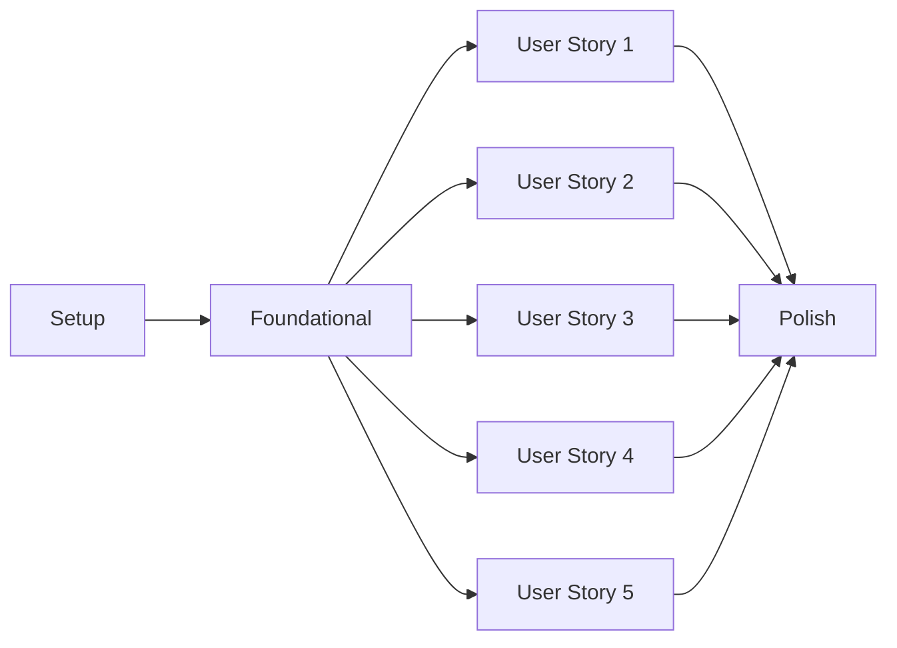

# Tasks: opencode support

**Branch**: `031-opencode-support` | **Date**: 2026-06-22 | **Spec**: [spec.md](./spec.md)

## Summary

Implement stack-control as an opencode plugin that delegates to the `stackctl` CLI for all operations, making stack-control skills available through opencode's command system.

## Dependencies

## Implementation Strategy

**MVP Scope**: User Story 1 (core skill invocation) + User Story 2 (plugin installation)

**Incremental Delivery**:
1. Phase 1-2: Setup and foundational plugin structure
2. Phase 3: User Story 1 - Basic skill invocation via command mapping
3. Phase 4: User Story 2 - Plugin installation documentation
4. Phase 5: User Story 3 - CLI delegation implementation
5. Phase 6: User Story 4 - Event system integration
6. Phase 7: User Story 5 - Version reporting

---

## Phase 1: Setup

- [x] T001 Initialize TypeScript project for opencode plugin per implementation plan
- [x] T002 Create plugin directory structure at `plugins/stack-control/opencode/`
- [x] T003 Set up package.json with opencode plugin dependencies
- [x] T004 Configure TypeScript compilation for opencode plugin target

## Phase 2: Foundational

- [x] T005 Create plugin entry point `plugins/stack-control/opencode/index.ts` with plugin function export
- [x] T006 Implement skill registration in plugin initialization
- [x] T007 Create CLI delegation module `plugins/stack-control/opencode/cli.ts` with shell API wrapper
- [x] T008 Implement command parsing for `/stack-control:` prefix
- [x] T009 Add error handling for missing `stackctl` CLI (T007)

## Phase 3: User Story 1 - Use stack-control skills in opencode

- [x] T010 [US1] Create skill routing in `plugins/stack-control/opencode/skills.ts` to map `/stack-control:define` to the define skill
- [x] T011 [US1] Implement skill argument forwarding to CLI in `plugins/stack-control/opencode/cli.ts`
- [x] T012 [US1] Add skill output formatting in `plugins/stack-control/opencode/cli.ts` to return CLI output to opencode
- [x] T013 [US1] Create acceptance test `tests/opencode/skill-invocation.test.ts` verifying skill invocation chain

## Phase 4: User Story 2 - Install stack-control plugin in opencode

- [x] T014 [US2] Create installation guide `docs/installation.md` with copy/symlink instructions
- [x] T015 [US2] Add plugin metadata to package.json (name, version, opencode plugin identifier)
- [x] T016 [US2] Create verification script `bin/verify-install.ts` to check plugin loads correctly
- [x] T017 [US2] Add installation checklist to README.md with success criteria

## Phase 5: User Story 3 - Plugin delegates to stackctl CLI

- [x] T018 [US3] Implement `stackctl` command construction in `plugins/stack-control/opencode/cli.ts`
- [x] T019 [US3] Add non-zero exit code handling in `plugins/stack-control/opencode/cli.ts`
- [x] T020 [US3] Create CLI output capture and formatting in `plugins/stack-control/opencode/cli.ts`
- [x] T021 [US3] Add integration test `tests/opencode/cli-delegation.test.ts` verifying CLI invocation

## Phase 6: User Story 4 - Skill mapping to opencode events

- [x] T022 [US4] Implement `command.executed` event handler in `plugins/stack-control/opencode/events.ts`
- [x] T023 [US4] Add skill registration to opencode's command palette in `plugins/stack-control/opencode/index.ts`
- [x] T024 [US4] Create event mapping test `tests/opencode/event-mapping.test.ts` verifying command routing

## Phase 7: User Story 5 - Plugin version sync with stackctl CLI

- [x] T025 [US5] Add version reporting to plugin metadata in `plugins/stack-control/opencode/index.ts`
- [x] T026 [US5] Implement CLI version detection in `plugins/stack-control/opencode/version.ts`
- [x] T027 [US5] Add version mismatch warning in `plugins/stack-control/opencode/cli.ts`
- [x] T028 [US5] Create version test `tests/opencode/version-sync.test.ts` verifying version reporting

## Phase 8: Polish & Cross-Cutting

- [x] T029 [P] Add TypeScript types for opencode plugin API in `types/opencode.d.ts`
- [x] T030 [P] Create contributing guide `CONTRIBUTING.md` with development setup
- [x] T031 [P] Add CI/CD pipeline `.github/workflows/opencode-plugin.yml` for plugin builds
- [x] T032 [P] Create release process documentation `RELEASE.md` with versioning strategy
- [x] T033 Run full test suite and fix any failures
- [x] T034 Update plugin README.md with usage examples and troubleshooting section
